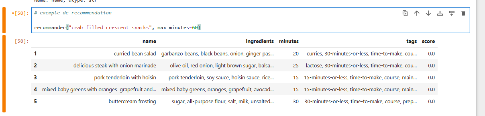
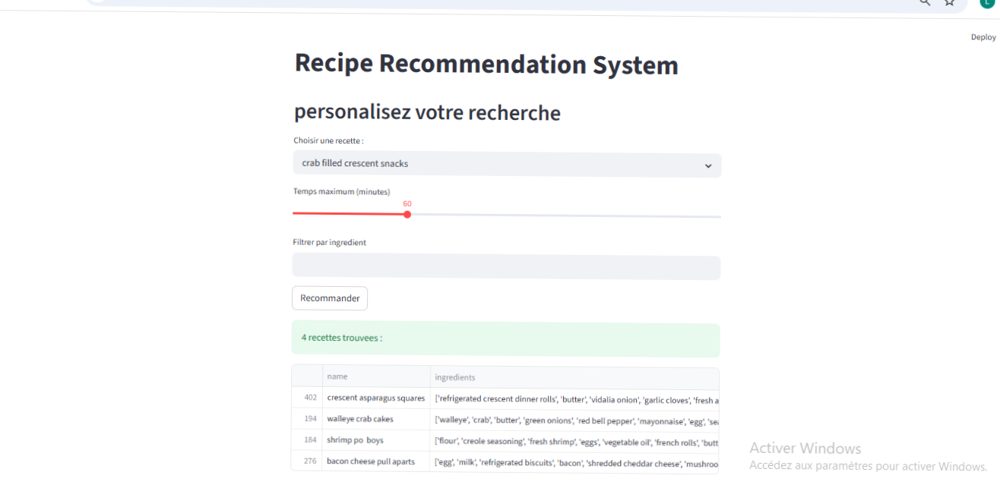
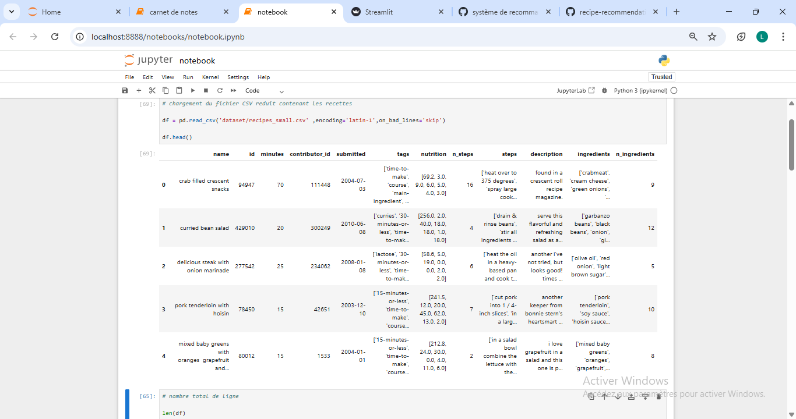

# Titre du projet

Recipe Recommendation System

# Domaine choisi

Artificial Intelligence

# Probleme choisi

Les utilisateurs ont souvent du mal a choisir une recette adaptee a leurs gouts, aux ingredients disponibles 
et au temps de preparation. Le projet vise donc a proposer automatiquemnt des recettes similaires a partir d'une
recette choisie par l'utilisateur.

# outils utilises

- Python
- Pandas
- Scikit-learn 
- Streamlit
- Jupyter Notebook

# Les instructions d'installation

pip install streamlit pandas scikit-learn jupyter notebook

# Les instructions pour lancer le projet

streamlit run app/app.py

# Les fonctionalites realisees

- recommendation de recettes
- filtre ingredients
- temps maximum
- interface Streamlit

# difficultes rencontrees
- telechargement et manipulation du dataset kaggle
- fichier trop volumineux pour Github
- comprehension et utilisation de TF-IDF
- affichage correct des images et videos dans le README
- confuguration de l'interface Streamlit.

# captures d'ecran

# Ameliorations possibles

Je pourrai ameliorer en ajoutant :
- un systeme de profil utilisateur
- prendre en compte les notes des utiisateurs
- ajouter les images des recettes et deployer l'application en ligne

# Ce que j'ai appris

Ce projet m'a permis de :
* comprendre le fonctionnement d'un systeme de recommandation en utilisant les TF-IDF et la similarite cosinus.
* manipuler des donnees avec pandas et nettoyer les donnees avec un dataset reel
* d'apprendre a creer une interface avec Streamlit.

